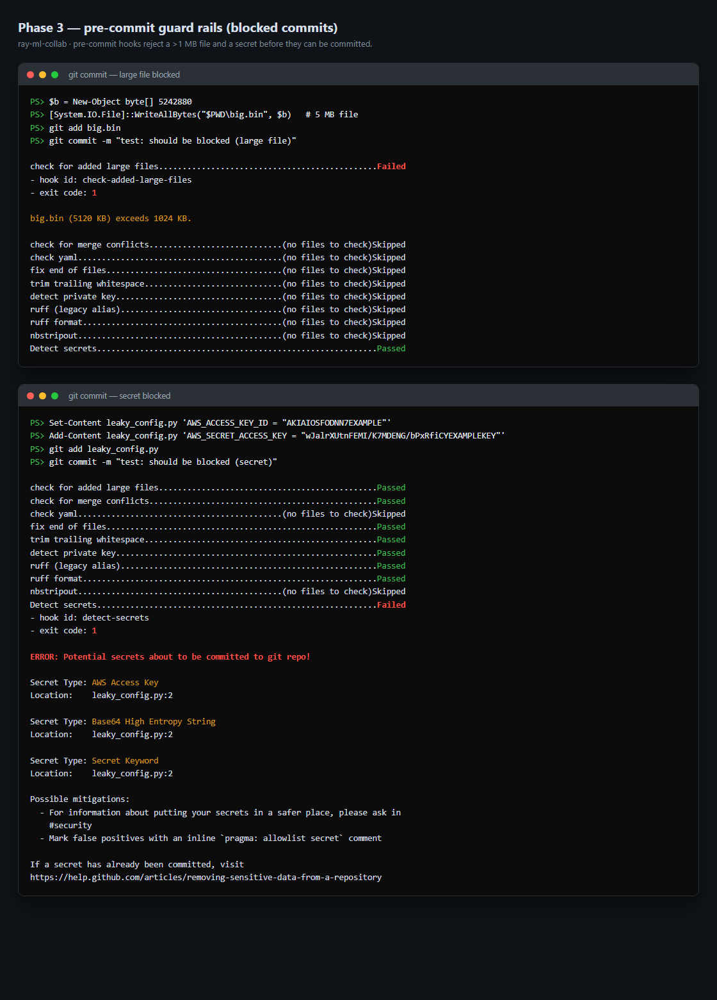
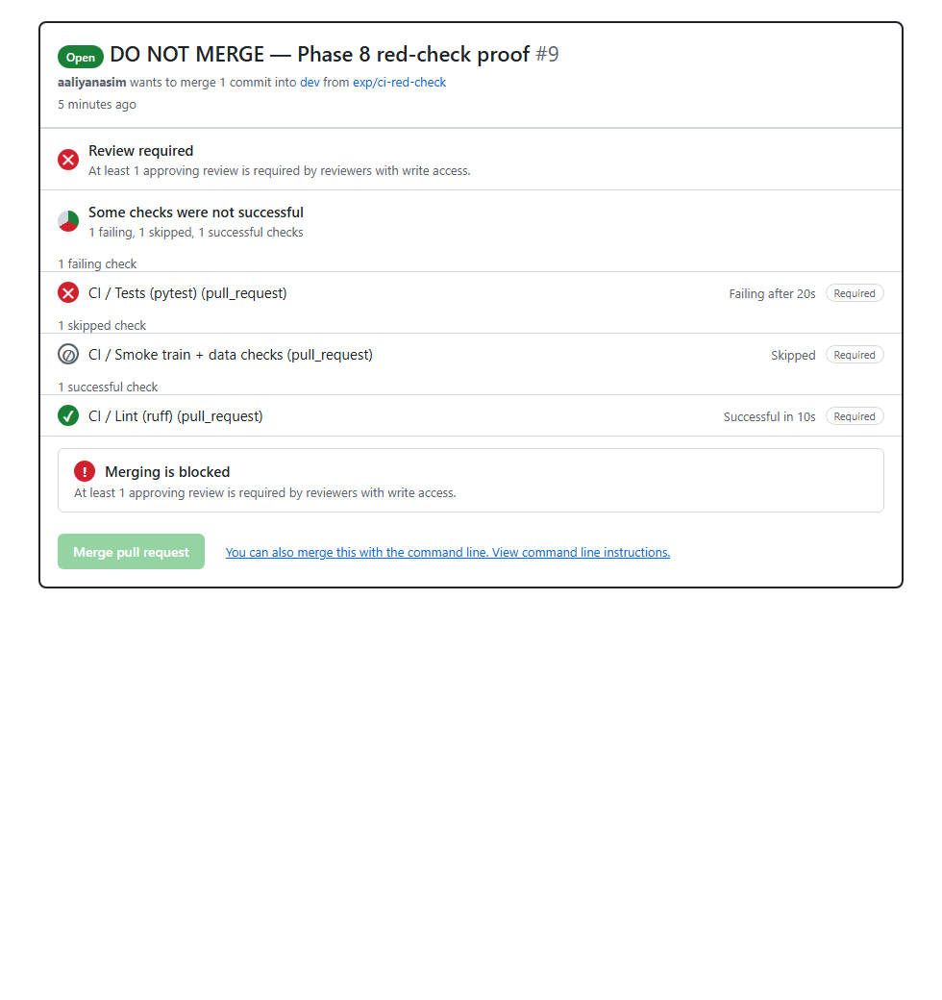

# REPORT — ray-ml-collab

Git-based collaboration for an ML project (MLOps Assignment 01). The **ray** team built a
reproducible financial-fraud detection pipeline end to end: versioned data and model, a DVC
pipeline, experiments, CI on every pull request, and a tagged release.

## 1. Team, roles and dataset

| Member | GitHub | Role | Owns |
|---|---|---|---|
| Aaliyan | aaliyanasim | Platform owner | CI, pre-commit, environment, releases |
| Yahya | yahyamobeen | Data owner | DVC, data checks, dataset updates |
| Rehan | Rehan00122 | Model owner | Training pipeline, configs, experiments |

- **Repository:** https://github.com/aaliyanasim/ray-ml-collab
- **Dataset:** [Financial Transactions Dataset for Fraud Detection](https://www.kaggle.com/datasets/aryan208/financial-transactions-dataset-for-fraud-detection)
  by aryan208 on Kaggle — tabular binary classification, 5,000,000 rows, 18 columns, target `is_fraud`
  (fraud rate 3.59%). The raw file is ~760 MB, far above the ~50 MB guidance, so the canonical
  DVC-tracked dataset is a fixed **300,000-row stratified sample** (seed 42, fraud rate preserved,
  ~47 MB) at `data/raw/financial_fraud_detection_dataset.csv`.
- **Sample generator:** `src/make_sample.py` (streaming, seed 42, byte-for-byte raw values).
- **Leakage:** `fraud_type` is populated only on fraud rows, so it is dropped in `src/prepare.py`.
  Identifier/PII columns are dropped by keeping only numeric features.

## 2. Reproducibility

| Item | Value |
|---|---|
| Seed | `42` (`params.yaml`) |
| Split | 80/20, stratified on `is_fraud` |
| Data hash (`.dvc`) | `md5 8306790a952b39ee5b82348fd20af0d3` |
| Environment lock | `pyproject.toml` + `uv.lock` (`uv sync`) |
| Pipeline | `dvc.yaml`: `prepare → train → evaluate` → `metrics.json` |
| Final params | `n_estimators=200`, `max_depth=8`, `class_weight=balanced_subsample` |
| Model commit | merge of PR #14 (final `dev`/release commit recorded in `.dvc`/tag) |
| Final metrics | accuracy 0.254 · precision 0.043 · recall 0.943 · F1 0.083 · ROC-AUC 0.582 |

Reproduce from a clean clone:

```bash
git clone https://github.com/aaliyanasim/ray-ml-collab && cd ray-ml-collab
uv sync
dvc pull          # fetch the DVC-tracked sample (DagsHub remote)
dvc repro         # prepare -> train -> evaluate
```

## 3. Experiments and selection

Fraud is only ~3.6% of rows, so **accuracy is misleading** — F1 and ROC-AUC drive the choice.

| Run | Params | Accuracy | Precision | Recall | F1 | ROC-AUC |
|---|---|---|---|---|---|---|
| baseline | depth none, no class weight | 0.964 | 0.000 | 0.000 | 0.000 | 0.577 |
| exp2 `exp/rehan-depth12` *(abandoned)* | depth 12, `balanced_subsample` | 0.373 | 0.044 | 0.789 | 0.083 | 0.581 |
| exp3 *(promoted, PR #14)* | depth 8, 200 trees, `balanced_subsample` | 0.254 | 0.044 | 0.943 | 0.083 | 0.582 |

**Why exp3 won:** the baseline never predicted fraud (F1 = 0); exp3 has the highest ROC-AUC and
recall at equal F1. **Abandoned branch:** `exp/rehan-depth12` is intentionally kept unmerged —
depth 12 gave lower recall/AUC than depth 8. Overall signal is weak (AUC ≈ 0.58), consistent with a
largely synthetic dataset; the value of the project is the reproducible workflow, not raw accuracy.

## 4. Pull requests

| PR | Title | Author | State |
|---|---|---|---|
| #1 | docs: add contributing guidelines | aaliyanasim | Closed (superseded by #2) |
| #2 | chore: project plan and repo cleanup | aaliyanasim | Merged |
| #3 | feat: scaffold reproducible training pipeline | Rehan00122 | Merged |
| #4 | chore: sync dev with main | Rehan00122 | Merged |
| #5 | chore: pin environment with uv | aaliyanasim | Merged |
| #6 | chore: add pre-commit guard rails | aaliyanasim | Merged |
| #7 | style: apply ruff formatting | aaliyanasim | Merged |
| #8 | chore: add CI | aaliyanasim | Merged |
| #9 | DO NOT MERGE — Phase 8 red-check proof | aaliyanasim | Closed (demo) |
| #10 | chore: add pull request template | aaliyanasim | Merged |
| #11 | data: track raw dataset sample with DVC | yahyamobeen | Merged |
| #12 | feat: EDA notebook + bucket_hour | Rehan00122 | Merged |
| #13 | fix: declare numpy dependency | aaliyanasim | Merged |
| #14 | feat: class_weight param, promote best experiment | Rehan00122 | Merged |
| #15 | fix: declare numpy dependency | aaliyanasim | Merged |
| #16 | docs: add REPORT.md | Rehan00122 | Merged |
| #17 | fix: declare matplotlib dependency | aaliyanasim | Open → merge to `dev` |
| #18 | docs: expand REPORT.md (screenshots + contributions) | aaliyanasim | Open → merge to `dev` |

**Cross-checks required by the assignment:**
- **Data-update PR:** #11 (DVC sample).
- **"Changes requested" review:** see PR #14 discussion (a reviewer requested `dvc.lock` + a commit
  SHA in `metrics.json` before approval). <!-- TODO: paste direct review link -->
- **Conflict-resolution PR:** TODO — real conflict on the same line of `params.yaml`, rebased on
  `dev` and documented in the PR. <!-- TODO: link -->
- **Abandoned `exp/` branch:** `exp/rehan-depth12` (unmerged, kept).
- **Release PRs:** `dev → staging` and `staging → main` (pending, Phase 9). <!-- TODO: links -->
- **Tag:** `model-v1.0` on `main` (pending).

## 5. CI (Phase 8)

`.github/workflows/ci.yml` runs on every PR into `dev`/`staging`/`main` (and pushes to `dev`):
- **Lint (ruff):** `ruff check` + `ruff format --check`
- **Tests (pytest):** full suite (pipeline smoke, data checks, feature/sampling tests)
- **Smoke train + data checks:** synthetic 500-row sample → `prepare → train → evaluate`, then
  `src/data_checks.py` (schema / ranges / nulls / leakage); uploads `metrics.json` and (bonus) posts
  it as a CML PR comment. A deliberately broken test was used to prove a red check blocks merging.

## 6. Retrospective — what broke

- **CI red on merge order:** PR #8 lint failed because the PR #7 formatting had not merged yet;
  fixed by merging #7 first and updating the branch (branch-protection "up to date" rule).
- **Notebook lint:** PR #12 failed on a long line — ruff lints `.ipynb` too (nbstripout keeps them clean).
- **Undeclared dependencies:** `pyyaml`, `numpy`, `matplotlib` were only used transitively and broke
  fresh environments; each was caught and declared (PRs #13, #15).
- **DVC credentials:** `dvc pull` looked like "file missing"; the DagsHub repo is private, so
  credentials had to be set with `dvc remote modify origin --local` (kept in `.dvc/config.local`).
- **`.gitignore` vs DVC:** the initial blanket `data/`/`models/` ignores would have hidden DVC
  pointers; fixed in PR #2 (file-level patterns only).
- **Topology drift:** the plan+cleanup landed on `main` before `dev`; `dev`/`staging` were
  fast-forwarded and dead branches deleted.

Added to `CONTRIBUTING.md`: squash-merge policy, branch protection note, conventional-commit
prefixes, and the PR review checklist (also mirrored in the PR template).

## 7. Screenshots

**Phase 3 — pre-commit blocks a >1 MB file and a fake secret** (commit aborted in both cases):



**Phase 8 — a deliberately failing test gives a red check that blocks merging**
(shows the red `Tests (pytest)`, the skipped smoke job, the green `Lint (ruff)`, and the
"Merging is blocked" banner):



A standalone *passing* CI run is the same three checks all green (e.g. PR #14/#15); the image
above already includes a successful `Lint (ruff)` check for contrast.

## 8. Contributions (one paragraph per member)

**Aaliyan (Platform owner).** I owned the environment, guard rails, CI and release mechanics. I
pinned the project with `uv` (`pyproject.toml` + `uv.lock`) and normalised line endings with
`.gitattributes`; built the pre-commit guard rails (`ruff`, `ruff-format`, `nbstripout`,
`check-added-large-files --maxkb=1024`, `detect-secrets`) and captured the proof that a 5 MB file
and a fake AWS key are both blocked; wrote the GitHub Actions workflow covering lint, tests and a
smoke train plus data-quality checks on every PR; fixed the branch topology so work flows
`dev → staging → main`; cleaned up merged branches; added the PR template and review checklist; and
kept dependency hygiene (`pyyaml`, `numpy`, `matplotlib`). I also produced the Phase-3 and
Phase-8 evidence screenshots and coordinated the release tagging.

<!-- TODO: replace/confirm the paragraphs below with each member's own words -->
**Yahya (Data owner).** I set up DVC and the DagsHub remote (credentials kept out of Git in
`.dvc/config.local`), and wrote the reproducible stratified sampler `src/make_sample.py` that reduces
the 5M-row Kaggle file to a fixed 300k-row, seed-42 sample (~47 MB, fraud rate preserved). I tracked
the sample with DVC (only the `.dvc` pointer is in Git), verified that `dvc pull`/`dvc push` work,
and documented the dataset source and regeneration steps in `README.md`.

**Rehan (Model owner).** I built the training pipeline — `src/prepare.py`, `src/train.py`,
`src/evaluate.py` — refactored to a CLI with no hardcoded paths, and wired `params.yaml`/`dvc.yaml`
(prepare → train → evaluate). I created the jupytext-paired EDA notebook, extracted the reusable
`bucket_hour` feature into `src/features.py` with unit tests, and ran the experiments (`exp/`
branches) that selected the promoted model (`class_weight=balanced_subsample`, `max_depth=8`,
`n_estimators=200`). I also drafted this report.

## 9. Release

Tag **`model-v1.0`** on `main` after the `dev → staging → main` release PRs and an independent
reproduction by a member who did not train the model (pending, Phase 9).
